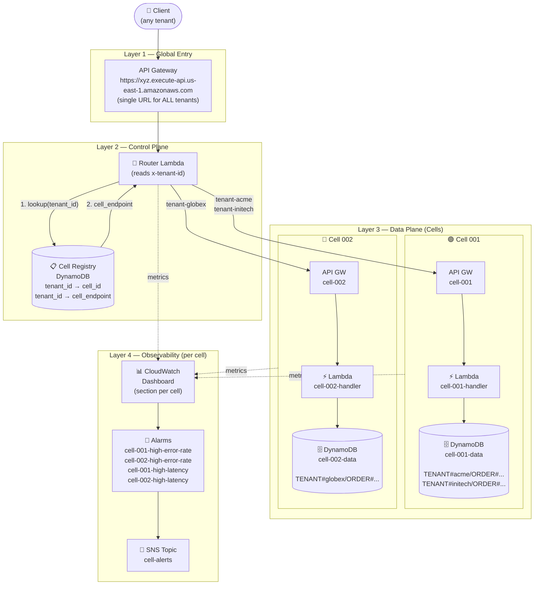
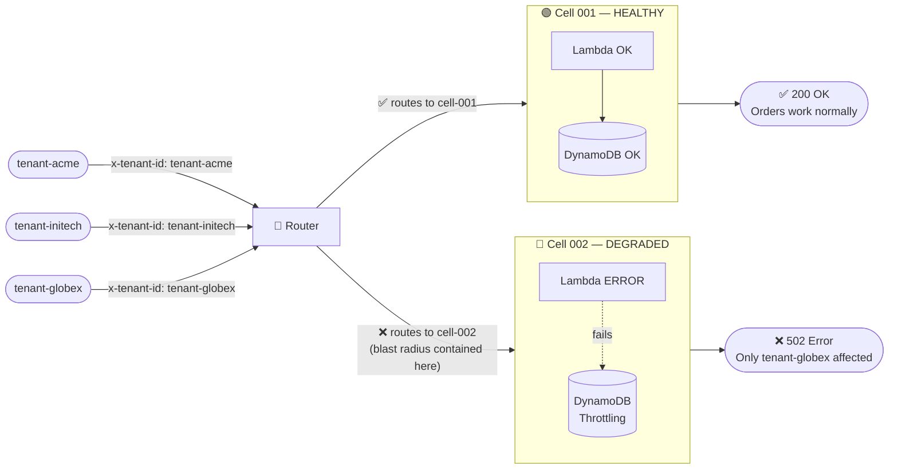
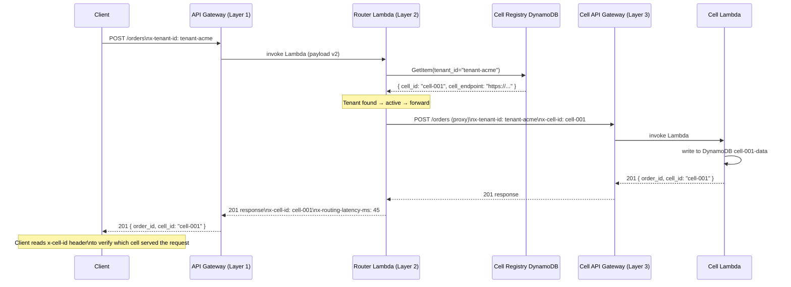
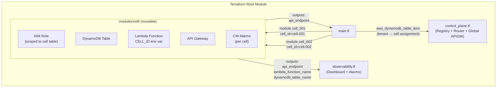
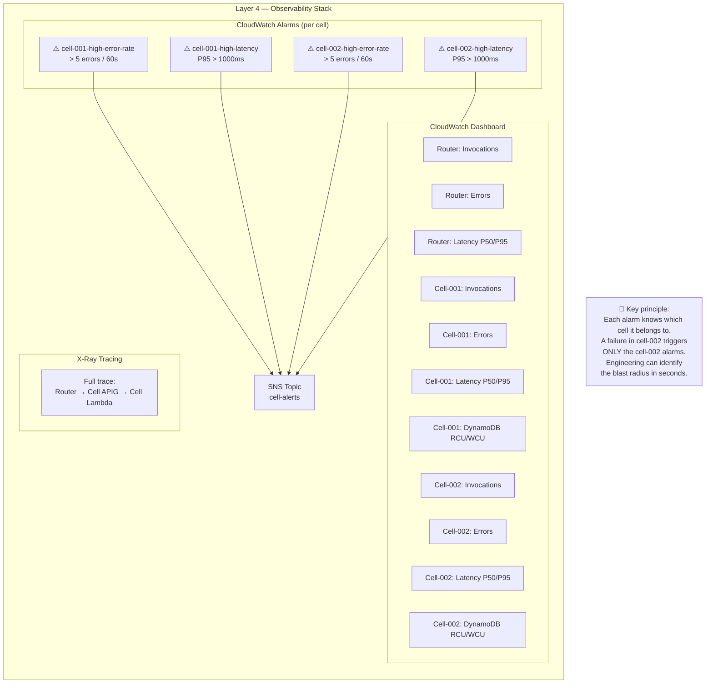

# Cell-Based Architecture — Diagrams

## Diagram 1: The 4 Architecture Layers



---

## Diagram 2: Blast Radius Isolation (Cell Failure)

Scenario: **cell-002 starts failing**. What happens?



> **Blast radius = ONLY the tenants assigned to cell-002**.
> tenant-acme and tenant-initech never see the error.

---

## Diagram 3: Cell Router Request Flow (Control Plane)



---

## Diagram 4: How the Terraform Module Works (IaC)



> Adding a **new cell** is as simple as:
> ```hcl
> module "cell_003" {
>   source        = "./modules/cell"
>   cell_id       = "cell-003"
>   environment   = var.environment
>   project       = var.project
>   alarm_sns_arn = aws_sns_topic.cell_alerts.arn
> }
> ```

---

## Diagram 5: Observability Aligned to Cell-Based Architecture



---

## Project Structure

```
cell-based-architecture-demo/
├── terraform/
│   ├── main.tf                  # Provider + instantiates cells + seeds tenants
│   ├── variables.tf             # aws_region, environment, project
│   ├── outputs.tf               # router_endpoint, test_commands
│   ├── control_plane.tf         # Cell Registry + Router Lambda + Global API GW
│   ├── observability.tf         # CloudWatch Dashboard + Alarms per cell
│   └── modules/
│       └── cell/                # Reusable module — 1 instance = 1 complete cell
│           ├── main.tf          # IAM + DynamoDB + Lambda + API GW + Alarms
│           ├── variables.tf     # cell_id, environment, project, alarm_sns_arn
│           └── outputs.tf       # api_endpoint, lambda_function_name, etc.
├── terraform/lambda/
│   ├── router/handler.py        # Control plane: lookup registry → proxy to cell
│   └── cell/handler.py          # Data plane: orders CRUD (isolated per cell)
├── docs/
│   └── architecture.md          # This file (Mermaid diagrams)
└── scripts/
    └── test.sh                  # Automated tests post-deploy
```
